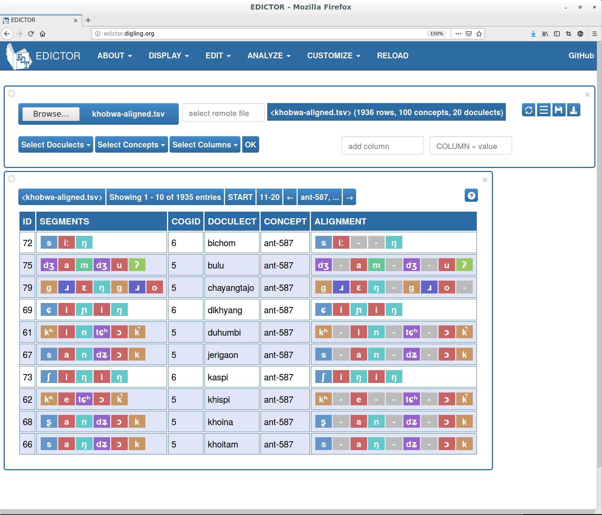

# Tutorial accompanying the chapter "Managing historical linguistic data for computational phylogenetics and computer-assisted language comparison"

# Tresoldi, Tiago; Rzymski, Christoph; Forkel, Robert; Greenhill, Simon J.; List, Johann-Mattis; Gray, Russell D.

This tutorial supplements the aforementioned chapter and intentionally follows a similar progression of analysis. The aim is to facilitate the understanding of the more theoretical topics of the chapter while allowing readers to see step-by-step examples of the input, intermediate, and output files of a common phylogenetic analysis.

The workflow uses the Python programming language and several libraries developed at the Max Planck Institute for the Science of Human History (MPI-SHH), in particular the `lingpy` library. All these libraries are free and open source. For more information on LingPy, we recommend readers see the tutorial published as [supplementary material](https://github.com/lingpy/lingpy-tutorial) to "[Sequence comparison in computational historical linguistics](https://academic.oup.com/jole/article/3/2/130/5050100)" by List et al. (2018). 

## 1 Getting Started

We assume readers are familiar with the essentials of command-line operation on either Unix-like systems (such as Linux and MacOS) or Windows systems. Likewise, we assume that the system is updated and that [Python](https://www.python.org/) is installed, along with its package manager `pip` and the `wheel` package. The latter might be necessary for installing the supporting libraries and, in those situations, it must be available *before* installing them.

We strongly recommend using virtual environments for reproducing the steps outlined here. Virtual environments are a practical solution for creating independent configurations for testing and experimenting, that do not interfere with any other Python programs installed on the system. More information on virtual environments can be found on the [Python documentation](https://docs.python.org/3/tutorial/venv.html). In most systems, a virtual environment can be created by calling `python -m venv env`. Once created, the environment can be activated with `source env/bin/activate` and deactivated with the `deactivate` command.

After all the dependencies have been installed, a virtual environment with the libraries required by this tutorial can be installed with:

```
python -m venv env
source env/bin/activate
pip install --upgrade wheel
pip install -r pip-requirements.txt
```

All the code snippets below assume that the necessary libraries have already been imported in Python. The full list of imports, which can be executed upon initialization and for testing that all libraries were properly installed, is:

```python
import lingpy
from lingpy.convert.strings import matrix2dst, write_nexus
from lingpy.compare.sanity import average_coverage, mutual_coverage_check, synonymy
from lingpy.evaluate.acd import bcubes
from tabulate import tabulate
```
## 2 Illustration of the Phylogenetic Data Life-Cycle

### 2.1 Data Handling (Stage 1)

As this tutorial is intended to illustrate the management of data for phylogenetic analyses, we will not discuss common operations of data collection, normalization, etc. A data set for Kho-Bwa languages derived from Lieberherr and Bodt (2017) is distributed along with this document, and mirrors the final stage of data preparation that is expected. While `lingpy` can load directly from single-table wordlists, such as those produced with a spreadsheet program, we recommend converting data to a common format, [CLDF](https://cldf.clld.org/), before adapting this tutorial to other needs. More detailed explanations are given in `lingpy` and `CLDF` documentation, and the single-table wordlist that served as a source the CLDF data, which can be compared to the CLDF data set, can be found as a supplementary material to Lieberherr and Bodt (2017).

#### 2.1.1 Creating and Curating Data in CLDF

While the details and advantages of CLDF have been discussed and presented in Forkel et al. (2018), we would like to highlight the benefits for historical linguistics and, by extension, phylogenetic analyses. While at first glance CLDF might seem daunting or unnecessary, it has many benefits. First, the structure is easily importable into standard statistical and analytic tools in many programming languages or analysis packages. Second, CLDF gives researchers a powerful toolset to express relational data structures in well-supported open formats, namely CSV and JSON. Third, the metadata contained within CLDF describes the data structure for enabling permanent documentation of the data structure, and facilitating the re-use of the data. Further, the metadata allows known types of columns to be validated and checked for incorrect content ensuring that the data is correct. Fourth, CLDF is linked data which means that any type of extra information can be easily added to the data set by linking it to the relevant identifier (see for example the embedded information concerning languoids and concepts in the Kho-Bwa sample data set). These data exist independently of any other software stack as all they can be stored in plain (but structured) text files. The fact that multiple files are 'glued' together by a JSON file, which specifies how files are related as well as metadata information for every file and column, allows for unique identifiers for every record, and guarantees maximum flexibility regarding research designs and experimental setups.

We support the creation as well as the conversion of CLDF-compatible data from a [variety of source materials](https://github.com/cldf/cookbook/tree/master/recipes) and CLDF can even be easily created from [within spreadsheet software like Microsoft Excel](https://github.com/cldf/cookbook/tree/master/recipes/excel). For the more systematic creation of CLDF data sets from different sources, we have created [`pylexibank`](https://github.com/lexibank/pylexibank/), a Python toolchain employed in the [Lexibank project](https://github.com/lexibank/). `pylexibank` makes it easy to create and curate CLDF data sets.

A first impression regarding the status of the data can be gained with the help of the Python `pycldf` package, which also makes a `cldf` command-line utility available. To validate the data, and to operate with CLDF data sets in general, we only need to refer to its JSON metadata file, as in: 

```
$ cldf validate cldf-khobwa/cldf-metadata.json
```

Note that `cldf validate` will generate no output if no issues are found.

Fundamental data set statistics can be obtained with the `cldf stats` command:

```
$ cldf stats cldf-khobwa/cldf-metadata.json
```

Which for this data set will output:

```
...
                Type              Rows
--------------  --------------  ------
forms.csv       FormTable         2144
languages.csv   LanguageTable       22
parameters.csv  ParameterTable     100
cognates.csv    CognateTable      2144
sources.bib     Sources              3
```

We can quickly verify that the data set contains 2144 forms, 100 concepts ("parameters") and 22 languages. Two of the languages (Eastern Puroik (Li) and Eastern Puroik (Sun)) included by Lieberherr and Bodt (2017) from other sources will be excluded from the data set in a next step, as suggested by the authors.

#### 2.1.2 Loading Data in LingPy

Due to the CLDF integration, it is possible to load CLDF data sets as a single, in-memory wordlist with `lingpy`. Here we will store the data in the `wl` variable:

```python
# load the wordlist from CLDF
wl = lingpy.Wordlist.from_cldf("cldf-khobwa/cldf-metadata.json",
    columns=('parameter_id',
             'concept_name',
             'language_id',
             'language_name',
             'value',
             'form',
             'segments',
             'language_glottocode',
             'concept_concepticon_id',
             'cognacy',
             'cogid_cognateset_id'),
             filter=lambda row: row["language_name"] != "Eastern Puroik (Li)"
                 and row["language_name"] != "Eastern Puroik (Sun)")
```

There are various ways to iterate over the data in the wordlist, such as directly indexing rows or by using the built-in `Wordlist.iter_rows()` method while using the column names listed in `wl.columns`. A quick check for consistency can be performed by tabulating the first rows of data:

```python
print(tabulate([wl[idx] for idx in range(1, 5)]))
```

```
-----  ---  -------  -------  ---------  ---------  ----------------  --------  ----  ---  ---
1_1sg  1SG  Duhumbi  Duhumbi  ga         ga         g a               chug1252  1209  101  101
2_2sg  2SG  Duhumbi  Duhumbi  naŋ        naŋ        n a ŋ             chug1252  1215  301  301
3_3sg  3SG  Duhumbi  Duhumbi  wɔj        wɔj        w ɔ j             chug1252  2642  501  501
4_ant  ant  Duhumbi  Duhumbi  kʰin-ʨʰɔk  kʰin-ʨʰɔk  kʰ i n + tɕʰ ɔ k  chug1252   587  701  701
-----  ---  -------  -------  ---------  ---------  ----------------  --------  ----  ---  ---
```

The statistics reported by the command-line `cldf` utility can be confirmed by inspecting the in-memory wordlist. Besides confirming the number of languages, concepts, and forms, we can extract more advanced statistics such as minimal and mutual average coverage of concepts across the languages in the data set. These statistics provide useful information that can help us ascertain if we have an acceptable amount of comparable material for a phylogenetic analysis.

Basic statistics can be obtained by querying directly the wordlist object:

```python
# count number of languages, number of rows, number of concepts
print("Wordlist has {0} languages and {1} concepts across {2} rows.".format(wl.width, wl.height, len(wl)))
```

Which confirms that our wordlist has 20 languages and 100 concepts across 1948 rows (or forms).

With `lingpy` providing functions to easily compute coverage statistics:

```python
# Check mutual coverage
for i in range(wl.height, 0, -1):
    if mutual_coverage_check(wl, i):
        print("Minimal mutual coverage is at {0} concept pairs.".format(i))
        break


# check avarage coverage
print('Avarage coverage is {0:.2f}.'.format(average_coverage(wl)))
```

Which, for this data set, will report a reasonable minimal coverage of 87 concepts and 94% of average coverage. An additional important statistic about a data set is the number of potential synonyms, which should be as low as possible. Once more, `lingpy` offers methods and functions to easily collect this information:

```python
# check for synonyms
synonyms = synonymy(wl, languages="language_name")
num_synonyms = len(wl) - len(synonyms)
syn_ratio = 1 - (len(synonyms)/len(wl))
if num_synonyms == 0:
    print('Found {0} potential synonyms.'.format(num_synonyms))
else:
    print('Found {0} potential synonyms ({1:.2}%):'.format(num_synonyms, syn_ratio*100.0))
    for (language, concept), count in sorted(synonyms.items(), key=lambda x: x[0][0]):
        if count > 1:
            print('{0:15}  {1:12}  {2}'.format(language, concept, count))
```

Which will inform that we have 13 potential synonyms, a ratio low enough not to impact our analyses.

```
Found 13 potential synonyms (0.67%):
Bichom           1SG           2
Bichom           black         2
Dikhyang         bone          2
Dikhyang         eye           2
Dikhyang         flesh/meat    2
Jerigaon         house         2
Jerigaon         liver         2
Khoitam          bone          2
Khoitam          water         2
Rahung           3SG           2
Rahung           to do/make    2
Rahung           water         2
Rahung           yesterday     2
```

#### 2.1.3 Retrieving Existing Data

In this tutorial, we are loading a CLDF data set directly, but for most experiments, especially when exploring wide cross-linguistic questions, it is worth it to obtain the data as a resource built upon the `pylexibank` library. In this case, a data set similar to the one here distributed (but with the two languages removed for our exploratory purposes) can be installed as a `lexibank_lieberherrkhobwa` package. Data packages are not released on PyPI, but they can be installed with `pip` from `git` repositories, such as with:

```
pip install -e git+https://github.com/lexibank/lieberherrkhobwa.git#egg=lexibank_lieberherrkhobwa
```

When installed with `pip`, a CLDF data set can be loaded in different ways, the easiest of which is by loading from the metadata file:

```python
from lexibank_lieberherrkhobwa import Dataset as DS

cldf_metadata = DS().cldf_dir.joinpath('cldf-metadata.json')
wl_lexibank = lingpy.Wordlist.from_cldf(cldf_metadata,
    columns=('parameter_id',
             'concept_name',
             'language_id',
             'language_name',
             'value',
             'form',
             'segments',
             'language_glottocode',
             'concept_concepticon_id',
             'language_latitude',
             'language_longitude',
             'cognacy',
             'cogid_cognateset_id'))
```

### 2.2 Computer-Assisted Language Comparison (Stage 2)

#### 2.2.1 Sequence Alignment

Our data set provides cognate sets coded by experts, but no information on sequence alignment. Sequence alignment is a necessary step for many methods of automatic cognate detection, and can be used to support other tasks of comparative linguistics such as identification of sound correspondences.

LingPy can be used to align all forms belonging to same cognate set:

```python
alms = lingpy.Alignments(wl, transcription='form', ref="cogid", segments="segments")
alms.align(method='library')
```

We can explore the aligned forms with LingPy itself, such as for forms belonging to cognateset #5701, for `FAT (ORGANIC SUBSTANCE)`, which is shared by all languages in the data set:

```python
# Print the alignment for the first cogid (index #1)
print(lingpy.SCA(alms.msa['cogid'][5701]))
```

Which will return a nicely formatted table:

```
e	-	j	u	-
a	ʒ	-	ɔː	-
a	z	-	ua	-
ə	-	j	ou	-
ɔ	-	j	ɔ	w
a	-	j	ɔː	-
e	-	j	o	-
ɔ	-	j	u	-
a	-	j	ɔː	-
a	-	j	ɔː	-
a	z	j	aː	-
a	ʤ	-	ua	-
e	-	j	o	-
a	-	j	ɔ	w
a	z	j	aː	-
a	-	j	ɔː	-
a	z	-	ua	-
a	-	j	ɔː	-
e	-	j	u	-
e	-	j	u	-
```

The alignment object is a wordlist which carries information from its source, and can be written to disk as a single-table or CLDF data set. The alignment can therefore be easily exported into other tools, for example EDICTOR (described in #2.2.3), which is designed for exploration and manipulation of this kind of data. A tab-separated output, for example, can be generated with:

```python
alms.output('tsv', filename='khobwa-aligned', ignore="all", prettify=False)
```

#### 2.2.2 Cognate Identification and Evaluation

Even though this data set has expert cognate decisions already, we can also automatically infer cognates as well. Automatic cognate inference is useful in cases where there are no cognates, or for benchmarking the accuracy of the different available methods.

Here, we will use the pre-processed data from the file `khobwa-aligned.tsv` to create a `LexStat` scorer and perform detection using the three most common algorithms, `edit-dist`, `sca`, and `lexstat` (added as columns `editid`, `scaid`, and `lexstatid`, respectively):

```python
lex = lingpy.LexStat('khobwa-aligned.tsv', segments='tokens', check=True)
lex.get_scorer(runs=10000)
```

It is normal for this to take a while and to obtain a long output detailing the alignment and random correspondence. Once these steps are finished, we can run the methods for automatic cognate detection, each with its reference threshold and clustering method:

```python
cognate_detect = [
    ('edit-dist', 'editid', 0.75, 'upgma'),
    ('sca', 'scaid', 0.45, 'upgma'),
    ('lexstat', 'lexstatid', 0.55, 'infomap')
]

for method, ref, threshold, clustering in cognate_detect:
    lex.cluster(method=method, threshold=threshold, ref=ref, cluster_method=clustering)
```

Once all the methods have run, we can evaluate their performance:


```python
# Compute overall scores in terms of precision, recall, and f-score, and present it
ret = []
for column in ['editid', 'scaid', 'lexstatid']:
    precision, recall, fscore = bcubes(lex, 'cogid', column, pprint=False)
    ret.append([
        column, '%.3f' % precision, '%.3f' % recall, '%.3f' % fscore
    ])

print(tabulate(ret, headers=['Precision', 'Recall', 'F-score'], tablefmt='pipe'))
```

Which will detail how, for this data set, LexStat performs better than SCA, which performs better than Edit Distance (a performance that is replicated in most data sets):

```
|           |   Precision |   Recall |   F-score |
|:----------|------------:|---------:|----------:|
| editid    |       0.871 |    0.789 |     0.828 |
| scaid     |       0.92  |    0.766 |     0.836 |
| lexstatid |       0.916 |    0.812 |     0.861 |
```

The reported numbers might be slightly different due to the random permutations used in the detection method.

LingPy also allows for the detection of partial cognates, which can be used to compute cognate identifications based on shared or non-shared partial information. We will not explore this option here, as the resulting data does not change, but it is an option worth exploring for many data sets and better detailed in the aforementioned tutorial.

### 2.2.3 Manual Exploration and Manipulation

Data can be explored and manipulated with the [EDICTOR tool](http://edictor.digling.org), a web-based interface for the creation and curation of etymological dictionaries. EDICTOR essentially supports to edit and correct cognate judgments manually and also allows to inspect and correct phonetic alignments. In addition, one can use EDICTOR to inspect cognate set distributions, phoneme inventories, and morphological structures (full and partial colexifications), also allowing to export the data to Nexus format.



### 2.3 Exploratory Data Analysis (Stage 3)

#### 2.3.1 Distance Measures

The cognate set of each form, here reported in the `cogid` column, is the main material for phylogenetic analyses. For initial data exploration base in language distance, we can use LingPy's built-in function to obtain the distance matrix used by most methods, saving it to a `khobwa.dst` file.

```python
wl.get_distances(ref='cogid')
wl.output('dst', filename='khobwa')
```

The distance matrix file is a pure-textual file with the number of languages in the first row, preceded by a space, followed by one language and its distances per line, separated by a space (in which case the language name should not be longer than ten characters, or by a tabstop, which is not reflecting the official standard, but accepted by many software packages). The file can be checked with standard shell commands or passed to other programs like [SplitsTree](http://splitstree.org):

```
$ head -n 3 khobwa.dst
 20
Bichom  0.0000  0.5506  0.5618  0.0909  0.5730  0.6092  0.1461  0.5843  0.6250  0.6180  0.5169  0.5618  0.0787  0.6180  0.5227  0.6180  0.5281  0.6250    0.0449  0.0674
Bulu    0.5506  0.0000  0.3300  0.5567  0.5600  0.5204  0.5730  0.5400  0.5354  0.5000  0.1700  0.3400  0.5618  0.5200  0.2062  0.5400  0.2700  0.5455    0.5618  0.5618
```


#### 2.3.2 Distance-Based Phylogenetic Trees

Distance matrices can be used for additional methods of data exploration, such as building distance-based trees with algorithms like Neighbor joining (NJ) and Unweighted Pair Group Method with Arithmetic-mean (UPGMA). Many software packages, including _SplitsTree_, can use such matrices, with LingPy already providing methods for easy computation and display of such trees:

```python
tree = lingpy.Tree(wl.get_tree(ref='cogid', tree_calc='upgma', force=True))
print(tree.asciiArt(compact=True))
```

Which will print a nice ASCII representation:

```
                    /edge.0-- /-Duhumbi
          /edge.6--|          \-Khispi
         |          \edge.5-- /-Shergaon
         |                    \edge.4-- /-Rupa
         |                              \edge.3-- /-Jerigaon
         |                                        \edge.2-- /-Khoina
-root----|                                                  \edge.1-- /-Khoitam
         |                                                            \-Rahung
         |                    /-Kaspi
         |          /edge.11-|          /-Namphri
         |         |          \edge.10-|          /edge.7-- /-Bichom
         |         |                    \edge.9--|          \-Singchung
          \edge.17-|                              \edge.8-- /-Dikhyang
                   |                                        \-Wangho
                   |          /edge.13- /-Saria
                    \edge.16-|          \edge.12- /-Chayangtajo
                             |                    \-Lasumpatte
                              \edge.15- /-Bulu
                                        \edge.14- /-Kojo_Rojo
                                                  \-Rawa
```

The tree itself can be saved in standard Newick format for use in tree visualisation and manipulation software:

```python
# save tree to file:
tree.writeToFile("lieberherrkhobwa-upgma.trees")
```

### 2.4 Bayesian Phylogenetic Analysis (Stage 4)

Data can also be exported to perform Bayesian analysis with tools such as `BEAST2`, `MrBayes`, `RevBayes`, `APE`, etc., whose usage will not be discussed here. From the point of view of data-management, almost all software for phylogenetic analysis use data in some dialect of the NEXUS format, which can be generated from a wordlist with LingPy:

```python
# Save output for splitstree
nex = write_nexus(wl, mode="SPLITSTREE", filename="lieberherrkhobwa.nex")

# Save output for BEAST
nex = write_nexus(wl, mode="BEAST", filename="lieberherrkhobwa-beast.nex")
```

One important software of the phylogenetic toolbelt is `beastling`, which facilitates the interfacing of linguistic data with `BEAST2` and had full CLDF integration. As such, we can export our wordlist data in CLDF format and use it with the expanding range of software supporting CLDF:

```python
from lingpy.convert.cldf import to_cldf
to_cldf(wl, path='cldf-new')
```

### 2.5 Data Sharing (Stage 5)

Being able to export wordlists, with any additional information such as cognate sets coming from automatic cognate judgment, allows users to export, deploy, and share data sets easily. Both wordlists and CLDF data sets can be either provided as-is to users or, preferably, made available via on-line services such as GitHub and Zenodo. For CLICS, the Database of Cross-Linguistic Colexifications, we make heavy use of this and automatically publish all curated data sets from GitHub to the [CLICS Zenodo Community](https://zenodo.org/communities/clics/).

An interesting possibility is to rely on the infrastructure of `lexibank`, to deploy data sets as Python packages that can then be conveniently installed from the command line, and [`clld`](https://clld.org), to deploy them as online services. This makes publishing and serving curated data straightforward, and also has the advantage of facilitating anonymous sharing of data for review purposes, deploying it as a Python package on GitHub and using it by means of on-line services such as the Open Science Framework.

## 3 Conclusion

Given the complexity of the topic, the current tutorial can only provide an incomplete introduction to the world of data management in computational phylogenetics and computer-assisted language comparison. We hope, however, to have shown enough to ease the entry for readers with little experience in data managment and phylogenetic analysis.  If you have questions on the management of linguistic data for phylogenetic analyses or CLDF, don't hesitate to contact us at <lexibank@shh.mpg.de>. Questions about LingPy can be posted either as an issue on its [GitHub repository](https://github.com/lingpy/lingpy) or sent to <info@lingpy.org>.

